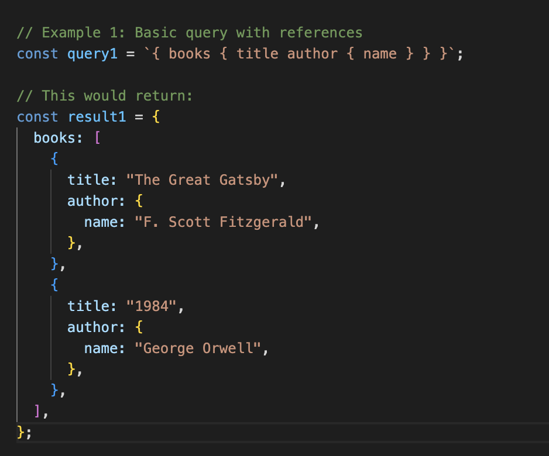
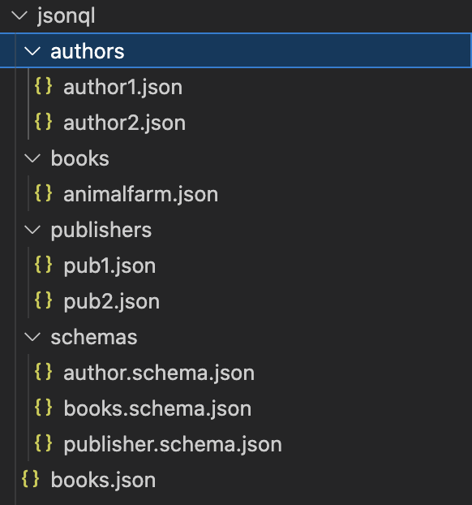

# JSONQL

A GraphQL-inspired query language for JSON documents with reference support.

## Concept

JSONQL lets you use GraphQL query syntax to fetch partial JSON from documents that may contain references to other JSON documents. The system:

1. Uses standard JSON with a `$ref` property that points to other JSON documents
2. Uses JSON Schema (`$schema`) for type definitions
3. Uses GraphQL's query syntax to specify which data to retrieve
4. Automatically resolves references as needed

## Installation

```bash
# Clone the repository
git clone https://github.com/yourusername/jsonql.git
cd jsonql

# Install dependencies
bun install

# run the test
bun test.ts
```

## Backstory

Imagine we had a convention in json that any value can contain a prop $ref that, if given, must lead to a other JSON document.

I want to use the graphql query language (but not the spec language) to fetch a partial JSON inclined looking up references when needed.

Could we use the same graphql query language to query partial json from it? instead of using the graphql spec we would use JSON Schemas for the JSON documents (found using $schema)

 

> Claude:

This is a fascinating concept! You're essentially describing a custom system that leverages the GraphQL query syntax (but not its schema definition language) to navigate JSON documents with reference links, using JSON Schema for type definitions instead of GraphQL's schema language.

Let's explore how this would work:

### Concept Overview

1. We use standard JSON with a `$ref` property that points to other JSON documents
2. We use JSON Schema (`$schema`) for type definitions instead of GraphQL's schema language
3. We use GraphQL's query syntax to specify which parts of the documents we want to retrieve
4. The resolver system would handle following the `$ref` links as needed

### Example Implementation

Let's say we have the following JSON documents:

And the corresponding JSON Schemas:

Now, let's implement our custom GraphQL-syntax query parser for this system:

Now let's see an example of using this system with some example queries:

### Advantages of This Approach

1. **Decoupled Data Structure**: JSON documents and schemas can exist independently, interlinked through references

2. **Lazy Loading**: Your system only needs to fetch referenced documents when the query actually requests their fields

3. **Familiar Query Syntax**: Developers familiar with GraphQL can use the same query syntax

4. **Schema Flexibility**: Using JSON Schema provides more flexibility in defining complex data structures and validations

5. **Standard JSON**: Your data remains in standard JSON format, which is supported by countless tools and languages

### Implementation Considerations

1. **Reference Resolution**: You'll need to handle circular references to prevent infinite loops

2. **Path Navigation**: For references with fragments (`#/books/0`), you need robust JSON path navigation

3. **Caching**: For performance, implement caching of JSON documents and resolved references

4. **Resource Management**: Consider how to handle large documents with many references without exhausting memory

5. **Error Handling**: Develop strategies for handling missing documents or invalid references

### Enhancements You Could Add

1. **Query Variables**: Add support for parameterized queries like in GraphQL

2. **Directives**: Add support for query directives to modify query behavior

3. **Schema Validation**: Validate query fields against the JSON Schema definitions

4. **Aliases**: Allow renaming fields in the query results

5. **Fragments**: Support for reusable query fragments

This approach gives you the best of both worlds: GraphQL's elegant query language for specifying exactly what data you need, combined with the flexibility and universality of JSON Schema for type definitions.
